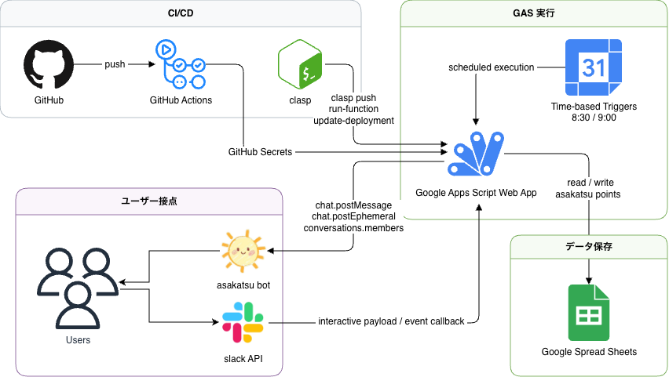

<div id="top"></div>

## 使用技術一覧

<p style="display: inline">
  
  
  
  
  
  
  
</p>

## 目次

1. [プロジェクトについて](#プロジェクトについて)
2. [環境](#環境)
3. [ディレクトリ構成](#ディレクトリ構成)
4. [開発環境構築](#開発環境構築)
5. [トラブルシューティング](#トラブルシューティング)

<br />

## プロジェクト名

朝活 Bot

## プロジェクトについて

Slack 上の朝活チェックインを Google Apps Script で受け付け、スプレッドシートにポイントを記録する Bot です。`main` ブランチへの push を契機に、GitHub Actions から Apps Script へ自動デプロイする前提で構成しています。

アプリケーション本体の実行環境は Google Apps Script です。`Node.js` は本番実行には使わず、`@google/clasp` を使ったローカル操作と GitHub Actions 上のデプロイ処理にだけ使います。

主な動作は次のとおりです。

- 毎日 8:30 に Slack へチェックイン投稿
- 8:30 以上 9:00 未満のボタン押下で 1 ポイント加算
- 同日 2 回目以降の押下は加算なし
- 8:30 より前、または 9:00 以降は加算なし
- 9:00 に未チェックイン者から 1 人をランダムにメンション
- `@bot` メンションで現在ポイントを返信

本番配備は `src/` の分割ファイル構成を使います。`.claspignore` により `appsscript.json`, `config.js`, `main.js`, `sheet.js`, `slack.js`, `triggers.js`, `utils.js` だけが `clasp push` の対象です。`src/Code.js` は旧構成の名残であり、本番デプロイ対象ではありません。

<p align="right">(<a href="#top">トップへ</a>)</p>

## アーキテクチャ



役割の対応:

- Slack: ボタン押下、メンション、通知先
- Google Apps Script: Webhook 受付、業務ロジック、Slack API 呼び出し
- Google Sheets: ポイント保存
- GitHub Actions: `main` push を契機に自動デプロイ
- clasp: Apps Script への反映と関数実行

<p align="right">(<a href="#top">トップへ</a>)</p>

## 環境

### 実行環境

| 項目 | バージョン |
| ---- | ---------- |
| Google Apps Script | V8 |
| JavaScript | ES2020 相当 |
| Slack Web API | v2 |
| Google Sheets | Apps Script 連携 |

### デプロイ・運用ツール

| 項目 | バージョン |
| ---- | ---------- |
| Node.js | 22.x |
| `@google/clasp` | 最新 |
| GitHub Actions | `ubuntu-latest` |

補足:

- Apps Script プロジェクト設定は [src/appsscript.json](/Users/yoshikoei98/asakatsu-gas-bot/src/appsscript.json) を参照
- ワークフローは [deploy-gas.yml](/Users/yoshikoei98/asakatsu-gas-bot/.github/workflows/deploy-gas.yml) を参照
- `.clasp.json` は Git 管理外です

<p align="right">(<a href="#top">トップへ</a>)</p>

## ディレクトリ構成

```text
.
├── .clasp.json.example
├── .claspignore
├── .github
│   └── workflows
│       └── deploy-gas.yml
├── .gitignore
├── README.md
├── README_TEMPLATE.md
└── src
    ├── Code.js
    ├── appsscript.json
    ├── config.js
    ├── main.js
    ├── sheet.js
    ├── slack.js
    ├── triggers.js
    └── utils.js
```

役割の要約:

- `src/main.js`: Slack の `doPost` とチェックイン処理
- `src/slack.js`: Slack payload 解釈と Web API 呼び出し
- `src/sheet.js`: スプレッドシートの読取・更新
- `src/triggers.js`: 朝の投稿と未チェックイン通知、トリガー管理
- `src/config.js`: 定数、Script Properties、CI 用初期化関数
- `src/utils.js`: 日付・乱択・レスポンスの補助関数
- `.github/workflows/deploy-gas.yml`: `main` push 時の自動デプロイ

<p align="right">(<a href="#top">トップへ</a>)</p>

## 開発環境構築

### 前提

ローカルと GitHub Actions で次を使います。

- Google アカウント
- Slack App
- Google Spreadsheet
- Node.js
- `@google/clasp`

Node.js は `clasp` をインストールして実行するために使います。アプリ本体は Node.js 上では動きません。

### ローカルセットアップ

`.clasp.json` を作成して `scriptId` を設定します。

```bash
cp .clasp.json.example .clasp.json
```

`.clasp.json` の例:

```json
{
  "scriptId": "YOUR_SCRIPT_ID",
  "rootDir": "src"
}
```

`clasp` で Apps Script へ反映します。

```bash
clasp push
```

初回だけ Apps Script エディタまたは `clasp run-function` で次を実行します。

- `setupSheet()`
- `installTriggers()`

CI 運用に入った後は `setupProjectFromCi_(true)` が同じ役割を持ちます。

### Apps Script 側の設定

Apps Script エディタで次を確認します。

- Web アプリ
- Execute as: `Me`
- Who has access: `Anyone`
- API executable
- 実行関数として `syncScriptPropertiesFromCi_` と `setupProjectFromCi_` を呼べる状態にする

### Script Properties

コードは次のキーを必須として読み込みます。

| キー | 役割 |
| ---- | ---- |
| `SLACK_BOT_TOKEN` | Slack Bot Token |
| `SLACK_CHANNEL_ID` | 通知先チャンネル ID |
| `SPREADSHEET_ID` | ポイント保存先 Spreadsheet ID |

取得箇所は [config.js](/Users/yoshikoei98/asakatsu-gas-bot/src/config.js) です。

### GitHub Actions の設定

`main` に push すると GitHub Actions が次を実行します。

1. `clasp push -f`
2. `syncScriptPropertiesFromCi_()` で Script Properties を更新
3. `setupProjectFromCi_(true)` でシート作成とトリガー再作成
4. `clasp create-version`
5. `clasp update-deployment`

GitHub Secrets には次を設定します。

| Secret 名 | 内容 |
| --------- | ---- |
| `CLASPRC_JSON` | `clasp login` 後の `~/.clasprc.json` 全文 |
| `CLASP_JSON` | `.clasp.json` の全文 |
| `GAS_DEPLOYMENT_ID` | 更新対象の Web アプリ deployment ID |
| `SLACK_BOT_TOKEN` | Slack Bot Token |
| `SLACK_CHANNEL_ID` | Slack の対象チャンネル ID |
| `SPREADSHEET_ID` | 利用する Spreadsheet ID |
